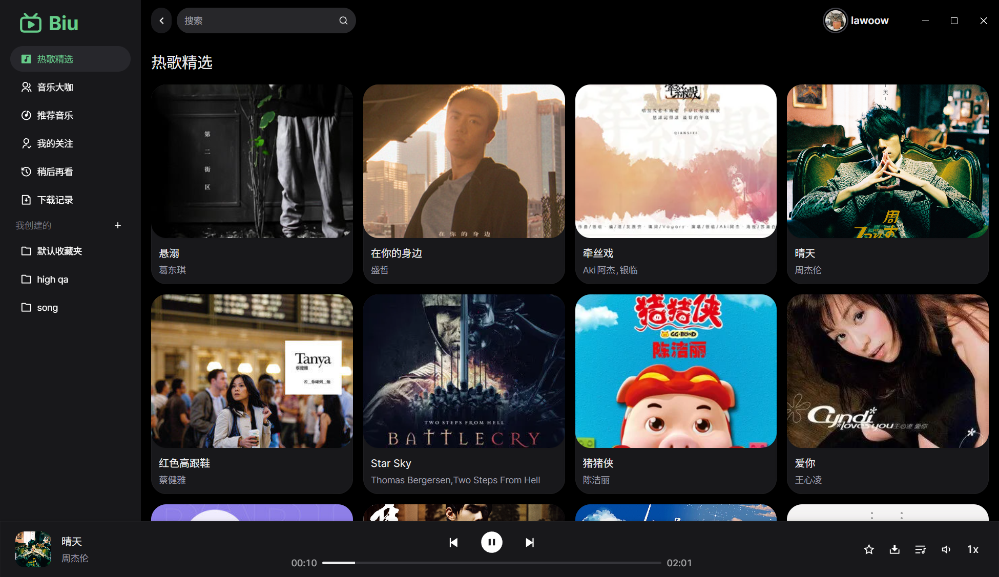
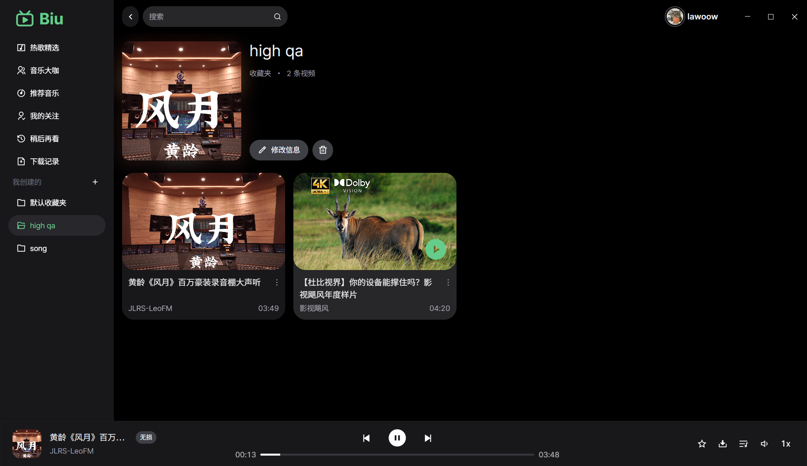
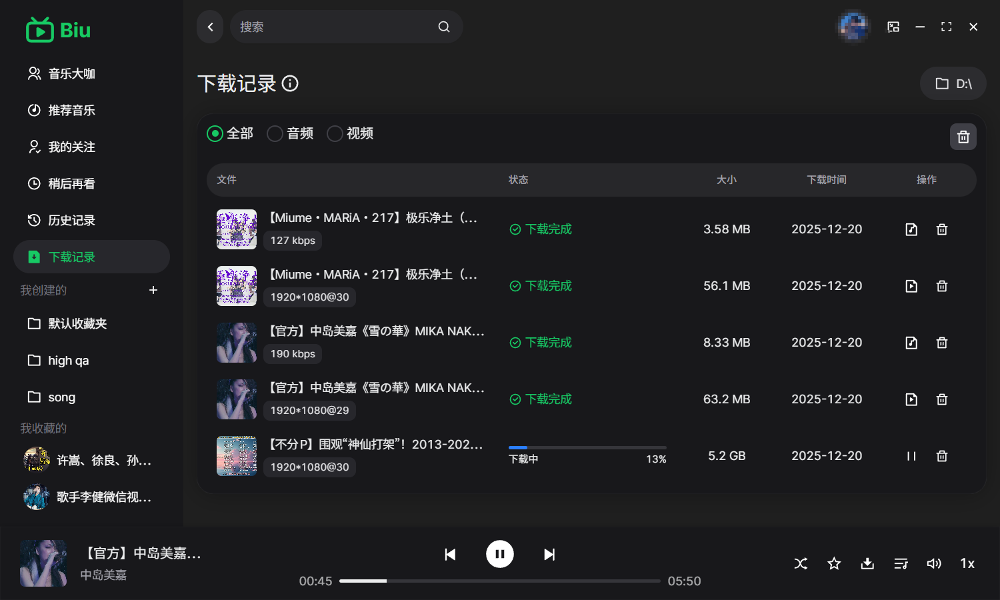
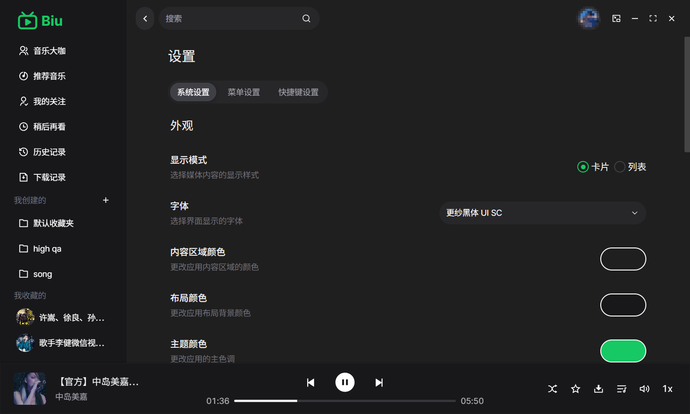
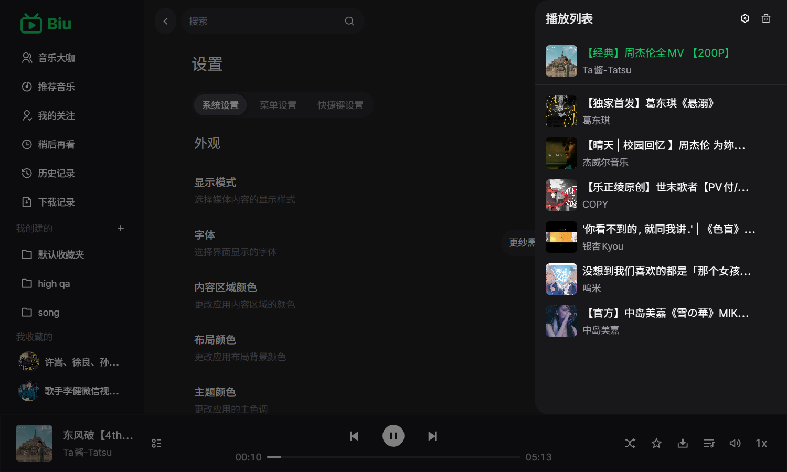

<h1 align="center">Biu 音乐播放器</h1>

  

  基于哔哩哔哩（B 站）公开接口的跨平台桌面音乐播放器 🎧🎶

  非官方项目，与哔哩哔哩无任何官方关联或背书

  
  

<table>
  <tr>
    <td width="50%" align="center">
      
    </td>
    <td width="50%" align="center">
      
    </td>
  </tr>
  <tr>
    <td width="50%" align="center">
      
    </td>
    <td width="50%" align="center">
      
    </td>
  </tr>
  <tr>
    <td width="50%" align="center">
      
    </td>
    <td width="50%" align="center">
      
 mini 播放器

      
    </td>
  </tr>
</table>

---

## ✨ 特色功能
- 🎼 支持登录 Bilibili 并获取收藏夹、稍后再看、历史记录等信息
- 🎧 高品质音频播放，优先拉取更高码率音频流（如无损 Flac，192K/Hi-Res）
- 🔥 支持视频文件以及提取视频中的音频下载；支持收藏夹视频批量下载
- 🧩 轻量界面，内置深色主题，同时可自定义部分主题样式，细腻的滚动与动效体验
- 💿 系统托盘与最小化隐藏（Windows），便捷控制播放
- 🍃 支持 mini 播放器模式，占用系统资源少，同时保留主窗口功能
- ♻️ 安装包支持自动检测更新，始终保持最新体验

## 下载和使用
- 下载页面：[GitHub Releases](https://github.com/wood3n/biu/releases/latest)
- 快速选择：
  -  优先选安装包 `win-setup`；需要免安装/无管理员权限选 `win-portable`
  -  优先选 `dmg`；需要脚本/自动化分发可选 `zip`
  -  优先选 `AppImage`；偏好包管理器可选 `deb`/`rpm`；Arch Linux 用户可选 AUR
- 常见产物对比如下（`<version>` 为版本号，`<arch>` 常见为 `x64`/`arm64`）：

<table>
  <thead>
    <tr>
      <th align="left">系统</th>
      <th align="left">推荐下载</th>
      <th align="left">优点</th>
      <th align="left">限制</th>
      <th align="left">文件名示例</th>
    </tr>
  </thead>
  <tbody>
    <tr>
      <td>
        
         
        <code>x64</code>/<code>arm64</code>
      </td>
      <td>
        安装包（NSIS）
         
        <code>win-setup</code>
      </td>
      <td>
        一键安装/卸载、开始菜单/桌面快捷方式 
        通常兼容性最好、适合长期使用 
        自动更新支持更完整
      </td>
      <td>
        需要安装到磁盘（非免安装） 
        可能触发系统权限/安全提示
      </td>
      <td>
        <code>Biu-&lt;version&gt;-win-setup-x64.exe</code> 
        <code>Biu-&lt;version&gt;-win-setup-arm64.exe</code>
      </td>
    </tr>
    <tr>
      <td>
        
         
        <code>x64</code>/<code>arm64</code>
      </td>
      <td>
        免安装版（Portable）
         
        <code>win-portable</code>
      </td>
      <td>
        解压/下载即用，不改系统配置 
        适合U盘/临时环境/无管理员权限
      </td>
      <td>
        应用内自动更新受限，通常需要手动下载替换
      </td>
      <td>
        <code>Biu-&lt;version&gt;-win-portable-x64.exe</code> 
        <code>Biu-&lt;version&gt;-win-portable-arm64.exe</code>
      </td>
    </tr>
    <tr>
      <td>
        
         
        <code>x64</code>/<code>arm64</code>
      </td>
      <td>
        DMG（推荐）
         
        <code>.dmg</code>
      </td>
      <td>
        拖拽安装体验好、适合大多数用户 
        分发与回收方便
      </td>
      <td>
        首次打开可能需要在系统设置中允许来源 
        不同系统安全策略提示不同
      </td>
      <td>
        <code>Biu-&lt;version&gt;-mac-x64.dmg</code> 
        <code>Biu-&lt;version&gt;-mac-arm64.dmg</code>
      </td>
    </tr>
    <tr>
      <td>
        
         
        <code>x64</code>/<code>arm64</code>
      </td>
      <td>
        ZIP
         
        <code>.zip</code>
      </td>
      <td>
        体积通常更小、适合脚本/CI 分发 
        解压即用
      </td>
      <td>
        安装体验不如 DMG 直观（需要手动放入应用目录）
      </td>
      <td>
        <code>Biu-&lt;version&gt;-mac-x64.zip</code> 
        <code>Biu-&lt;version&gt;-mac-arm64.zip</code>
      </td>
    </tr>
    <tr>
      <td>
        
      </td>
      <td>
        AppImage（最通用）
         
        <code>.AppImage</code>
      </td>
      <td>
        发行版通用、下载即运行 
        不依赖包管理器，适合多发行版
      </td>
      <td>
        需手动赋予可执行权限（例如 <code>chmod +x</code>） 
        桌面集成需要额外操作
      </td>
      <td>
        <code>Biu-&lt;version&gt;-linux-x64.AppImage</code> 
        <code>Biu-&lt;version&gt;-linux-arm64.AppImage</code>
      </td>
    </tr>
    <tr>
      <td>
        
      </td>
      <td>
        DEB / RPM
         
        <code>.deb</code> / <code>.rpm</code>
      </td>
      <td>
        更符合系统习惯，桌面/菜单集成更好 
        方便用系统包管理器安装/卸载
      </td>
      <td>
        与发行版/依赖关系更强（Debian/Ubuntu 用 <code>.deb</code>，Fedora/RHEL 用 <code>.rpm</code>）
      </td>
      <td>
        <code>Biu-&lt;version&gt;-linux-x64.deb</code> / <code>.rpm</code> 
        <code>Biu-&lt;version&gt;-linux-arm64.deb</code> / <code>.rpm</code>
      </td>
    </tr>
    <tr>
      <td>
        
      </td>
      <td>
        AUR (由<a href="https://github.com/cjlworld">@cjlworld</a>提供)
         
        <a href="https://aur.archlinux.org/packages/biu-bin"><code>biu-bin</code></a>
      </td>
      <td>
        通过 AUR 助手安装更新方便 
        符合 Arch 用户习惯
      </td>
      <td>
        依赖社区更新
      </td>
      <td>
        <code>paru -S biu-bin</code>
      </td>
    </tr>
  </tbody>
</table>

- 系统要求（建议）
  -  Windows 10 / 11（`x64` / `arm64`）
  -  macOS 12+（`x64` / `arm64`）
  -  主流 Linux 发行版（`x64` / `arm64`）
- 架构怎么选
  - Windows：设置 → 系统 → 关于 → “系统类型”（ARM 设备选 `arm64`，其余多为 `x64`）
  - macOS：Apple 芯片选 `arm64`，Intel 芯片选 `x64`
  - Linux：执行 `uname -m`，常见 `x86_64` 对应 `x64`，`aarch64` 对应 `arm64`
- 自动更新说明
  - 应用会定期检查 GitHub Releases，下载安装更新（多数安装方式均支持）。
  - Windows 免安装版（portable）在应用内下载更新受限，建议前往 Releases 手动下载替换。
- `*.yml`、`*.blockmap` 为自动更新辅助文件，手动下载时无需关注。
- 使用注意
  - 部分音频清晰度与解析可能需要登录或大会员权限。
  - 请遵循 Bilibili 使用条款，合理合规使用。

## 📄 许可证
本项目以 PolyForm Noncommercial License 1.0.0（非商业许可）发布，禁止任何商业用途。详情参见 [`LICENSE`](LICENSE)（SPDX：`PolyForm-Noncommercial-1.0.0`）。

---

如果你喜欢这个项目，欢迎 ⭐️ Star 支持！也欢迎提出 Issue 交流与反馈 🙌

## 🙏 鸣谢
- 特别感谢 [SocialSisterYi/bilibili-API-collect](https://github.com/SocialSisterYi/bilibili-API-collect) 对哔哩哔哩 API 的长期收集与整理，为本项目相关接口的使用提供了重要参考。
- 感谢 [@cjlworld](https://github.com/cjlworld) 为 Arch Linux 用户创建并维护了 [AUR 软件包](https://aur.archlinux.org/packages/biu-bin)，方便 Arch 用户通过 `paru -S biu-bin` 命令安装与更新。
- 在引用与使用相关资料时，我们遵循其许可条款（`CC-BY-NC 4.0`），仅用于学习与研究，不涉及任何商业用途。

## ⚖️ 法律声明与使用限制
- 本项目仅供学习与研究使用，禁止任何形式的商业用途（包括但不限于销售、收费服务、广告变现、商业集成等）。
- 本项目与 Bilibili 无任何官方关联或背书，不使用其商标与标识；涉及的名称与商标归其权利人所有。
- 数据来源于用户调用的公开接口与个人账户授权；使用时需遵守 Bilibili 的《用户协议》《社区规则》及相关法律法规。
- 禁止绕过登录/会员权限、DRM/加密措施，或进行批量爬取、恶意抓取等违反平台规则的行为。
- 如需商业授权或调整许可，请联系作者；如涉及权利或合规问题，请通过 Issues 反馈以便及时处理。
---

## 🤝 贡献指南
非常欢迎社区贡献！你可以按以下流程参与：

1. Fork 本仓库并创建分支：`feature/your-feature` / `fix/your-fix`
2. 开发并通过本地构建与基本自测（如：`pnpm dev`、`pnpm build`）
3. 提交 PR，详述改动点与影响范围
4. 通过 CI 的构建与审查后合入主分支

建议：
- 使用 ESLint/Prettier 保持代码风格一致（ESLint/Prettier 已配置）
- 提交信息简洁规范（推荐使用 `feat: ...`、`fix: ...` 等约定式格式）
- PR 中附上必要的截图或说明

## ♥️ Contributors

## 🌟 Star History

