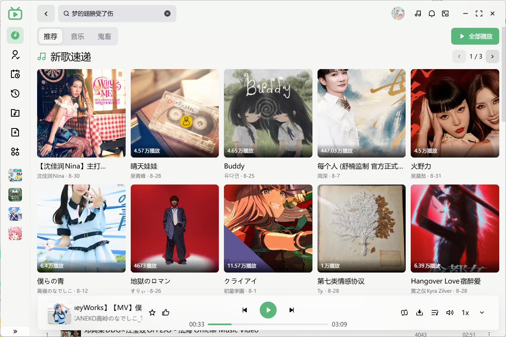
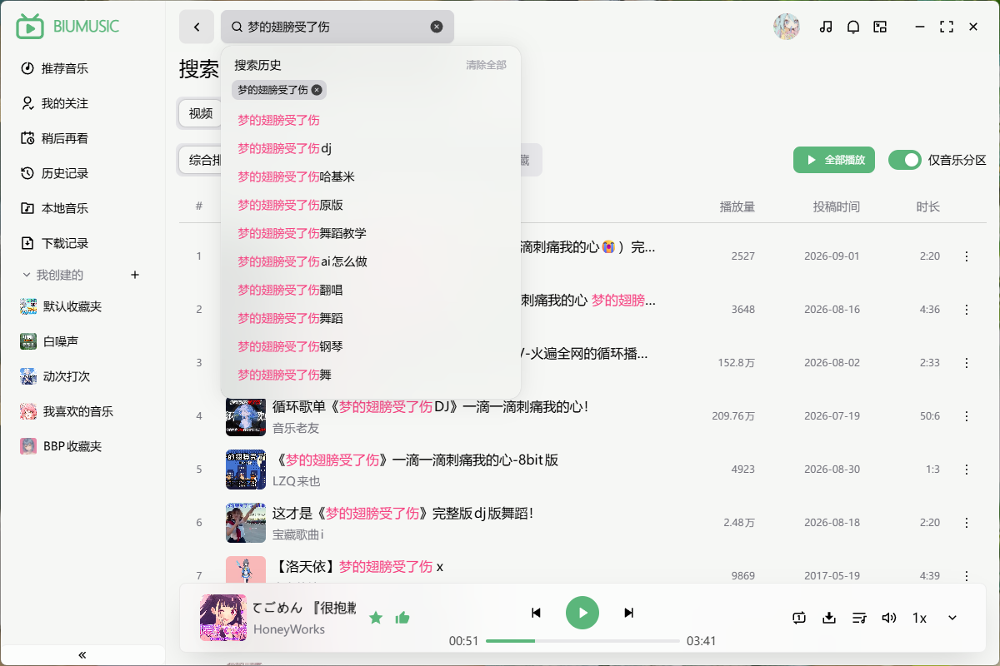
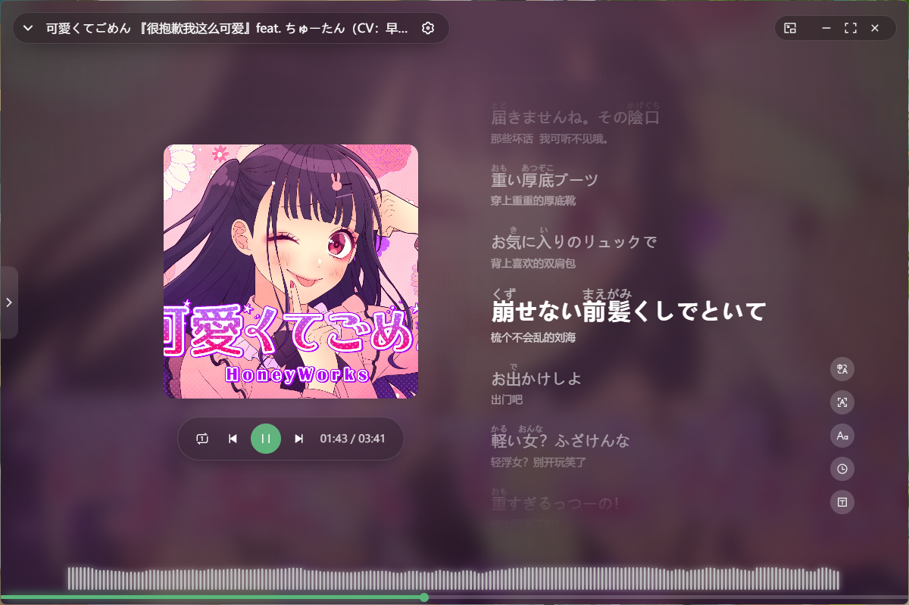
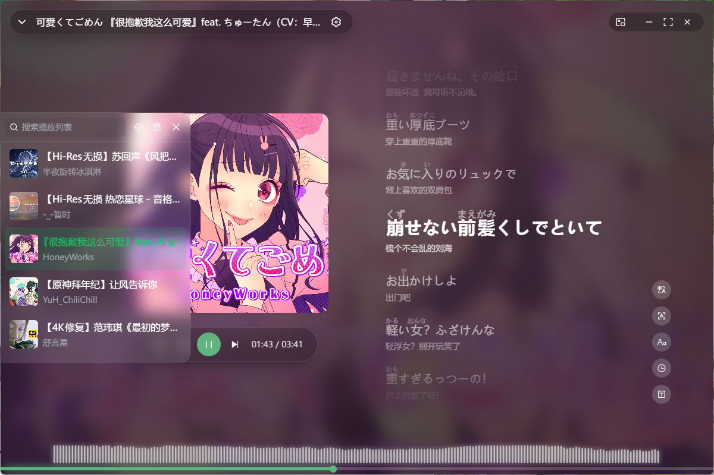
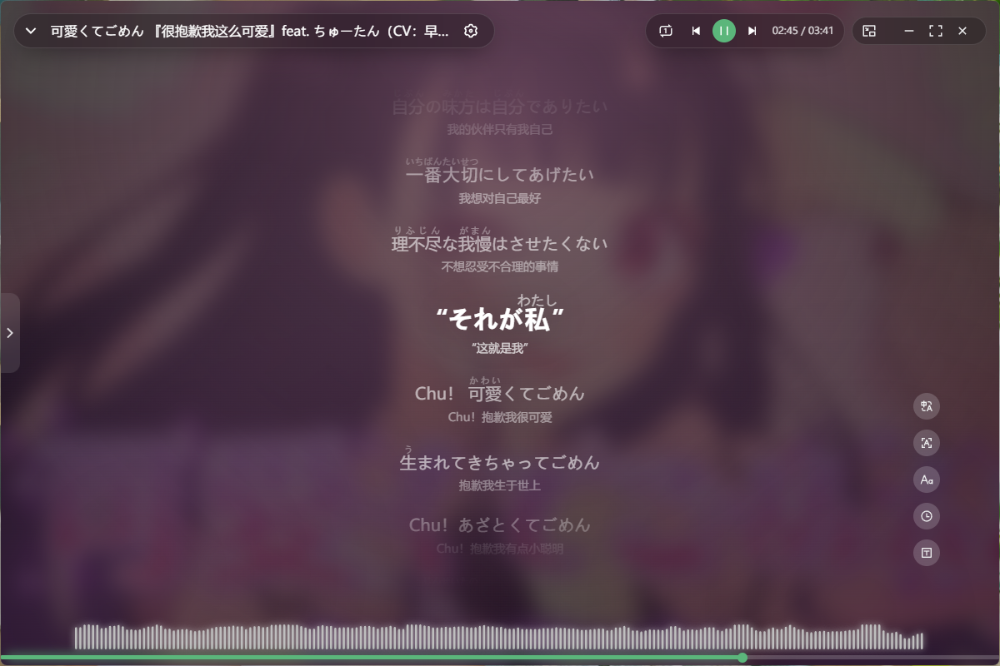
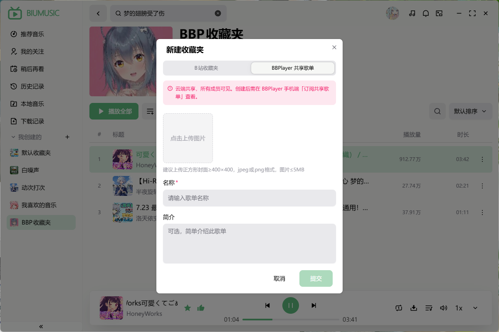
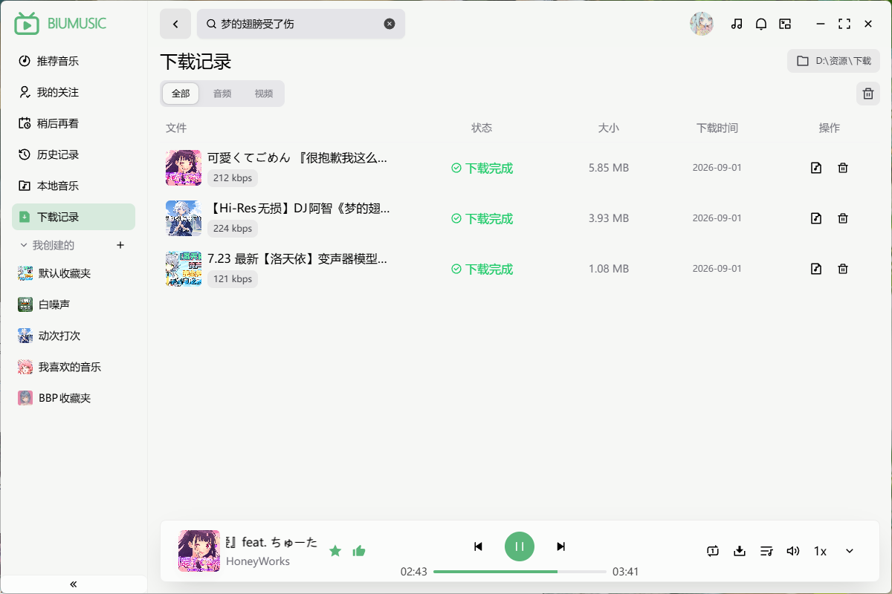
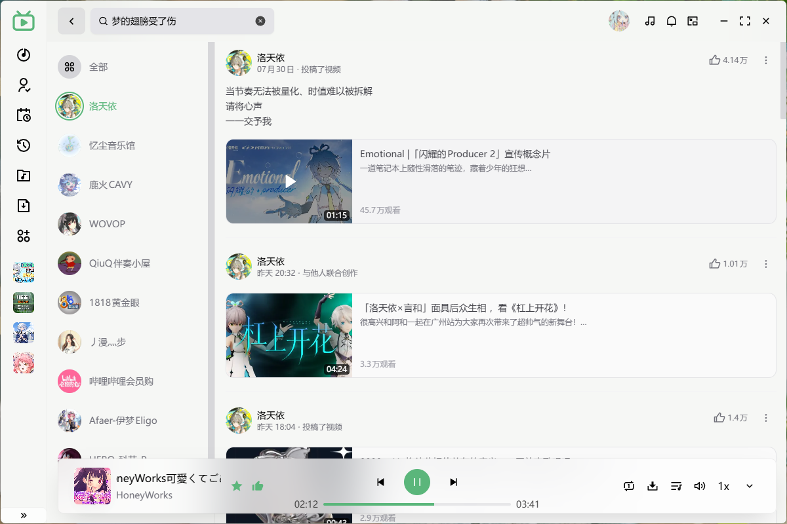
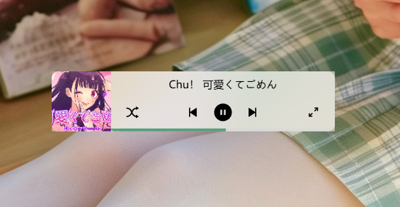

---
AIGC:
  ContentProducer: '001191110102MAD55U9H0F10002'
  ContentPropagator: '001191110102MAD55U9H0F10002'
  Label: '1'
  ProduceID: '132a59ec-0cf5-4005-97bd-bb5c4414715b'
  PropagateID: '132a59ec-0cf5-4005-97bd-bb5c4414715b'
  ReservedCode1: 'e5b7c10a-802e-44fa-872b-b5914f9d361a'
  ReservedCode2: 'e5b7c10a-802e-44fa-872b-b5914f9d361a'
---

<h1 align="center">Biu 音乐播放器</h1>

  

  基于哔哩哔哩（B 站）公开接口的跨平台桌面音乐播放器 🎧🎶

  非官方项目，与哔哩哔哩无任何官方关联或背书

  
  

<table>
  <tr>
    <td width="50%" align="center">
      
    </td>
    <td width="50%" align="center">
      
    </td>
  </tr>
  <tr>
    <td width="50%" align="center">
      
    </td>
    <td width="50%" align="center">
      
    </td>
  </tr>
  <tr>
    <td width="50%" align="center">
      
    </td>
    <td width="50%" align="center">
      
    </td>
  </tr>
  <tr>
    <td width="50%" align="center">
      
    </td>
    <td width="50%" align="center">
      
    </td>
  </tr>
  <tr>
    <td width="50%" align="center">
      
       
      迷你播放器
    </td>
    <td width="50%" align="left">
      <h4>迷你播放器功能</h4>
      <ul>
        <li>🎵 <b>动态歌词</b>：实时显示当前歌词行，文字溢出时自动滚动</li>
        <li>🏷️ <b>悬停显示歌名</b>：鼠标放在上一曲 / 播放暂停 / 下一曲按钮上时，切换显示「歌名 - 歌手」</li>
        <li>🪟 <b>Win11 亚克力毛玻璃</b>：Windows 11 系统级 Acrylic 背景模糊，半透明质感</li>
      </ul>
    </td>
  </tr>
</table>

---

## ✨ 特色功能

### 🌟 亮点功能

- **かな 日文歌词假名标注**：日文歌词自动标注假名注音（振假名），支持开关切换，方便学唱与阅读
- **🌐 歌词翻译可调**：歌词翻译支持开关、字体大小调节、时间偏移微调，满足不同阅读习惯
- **🔍 歌词自动搜索优化**：智能匹配歌词来源，自动搜索准确率与命中率大幅提升，减少手动查找
- **🪟 UI 重构与毛玻璃特效**：全新布局设计，全局毛玻璃（Glassmorphism）风格，侧边栏、播放列表、右键菜单、弹窗面板均采用主题感知毛玻璃背景
- **📱 BBPlayer 收藏夹兼容**：支持创建 BBPlayer 共享歌单，与手机端 BBPlayer 收藏夹双向兼容，云端同步

### 账号与登录
- 🔐 支持密码登录、短信登录，全局接入极验风控校验
- 📋 登录后可获取收藏夹、稍后再看、历史记录、用户动态等信息
- 👍 支持点赞按钮和一键三连功能

### 音频播放
- 🎧 高品质音频播放，优先拉取更高码率音频流（如无损 Flac，192K/Hi-Res）
- 🎵 支持音频质量偏好设置
- 📊 音频频谱波形可视化显示
- ♻️ 完善自动播放与优化自动搜索歌词逻辑，智能匹配准确率大幅提升
- 🔇 默认支持鼠标滚轮调整音量

### 下载功能
- 🔥 支持视频文件以及提取视频中的音频下载
- 📁 支持收藏夹视频批量下载
- ✂️ 下载功能支持断点续传
- 🎬 内置精简版 ffmpeg，无需额外安装即可提取音频；同时支持自定义 ffmpeg 系统路径设置

### 歌词功能
- 📜 全屏播放器歌词显示，逐行聚焦滚动，当前播放行高亮放大
- かな 日文歌词假名标注（振假名），支持开关切换，方便学唱
- 🌐 歌词翻译支持开关、字体大小调节、时间偏移微调
- 🔤 深色毛玻璃歌词面板风格，沉浸式阅读体验
- 🔍 歌词自动搜索优化，智能匹配准确率大幅提升

### 播放器界面
- 🖥️ 全屏播放组件，全新布局设计，左右分栏（封面+歌词），沉浸式体验
- 🎛️ 全屏播放器样式设置面板（Modal 居中弹窗，分区布局，深色毛玻璃胶囊风格）
- 📑 播放列表与分集列表改用整行右键菜单（移除三点按钮），支持播放列表内搜索
- 📜 文本无缝滚动（Marquee）：正在播放项常驻滚动，其余项 hover 滚动；播放栏标题常驻滚动
- 📂 播放栏折叠功能：折叠/展开改为水平拉伸弹回动画，不影响播放进度
- 🍃 迷你播放器模式，占用系统资源少，同时保留主窗口功能
  - 🎵 动态歌词：迷你窗口实时显示当前歌词行，溢出文字自动滚动
  - 🏷️ 悬停显示歌名：鼠标放在上一曲/播放暂停/下一曲按钮上时，切换显示「歌名 - 歌手」
  - 🪟 Win11 亚克力毛玻璃：Windows 11 系统级 Acrylic 背景模糊，半透明质感
- 📻 私人 FM 功能

### UI / 视觉体验
- 🪟 全局毛玻璃（Glassmorphism）风格：全新布局重构，侧边栏、播放列表、右键菜单、弹窗面板、搜索下拉、播放控制栏等均采用主题感知毛玻璃背景，深色模式下采用深色胶囊风格
- 🎨 UI 精细调校：间距/对齐/配色精确到像素，三色高亮主题色（#F56EE2 / #2C95FF / #01E3F8），控件 hover/active 状态统一处理
- 🌓 内置浅色和深色主题，支持跟随系统，可自定义部分主题样式
- 📋 支持 compact 紧凑模式 UI，优化页面列表显示
- ⬆️ 返回顶部按钮：毛玻璃 + 出场动画，全局可用
- 🪧 播放列表：主界面与全屏播放器均采用毛玻璃背景 + 正在播放绿色强调色
- 📐 avatar 尺寸自适应

### 侧边栏与收藏夹
- 🗂️ 侧边菜单支持拖拽排序、可折叠收缩，宽度支持拖拽修改
- 📁 收藏夹支持分组折叠、右键菜单、封面图设置、批量播放全部
- 🗂️ 收藏侧边栏专门优化，分组标题换行修复
- 📱 BBPlayer 共享歌单：支持创建 BBPlayer 共享歌单，与手机端 BBPlayer 收藏夹双向兼容，云端同步共享

### 内容浏览
- 🎵 每日推荐音乐，支持音乐/鬼畜分区显示
- 📰 顶部动态页面，补充动态更新提示
- 🎥 查看视频动态功能，分集视频支持搜索
- 👤 个人中心与资料页，歌手资料页
- 💿 本地音乐页面

### 系统集成
- ⌨️ 系统全局快捷键功能，支持快捷键控制播放
- 🔔 系统托盘与最小化隐藏，便捷控制播放
- 🍎 macOS Dock 右键菜单支持
- 🌐 代理设置功能
- ♻️ 安装包支持自动检测更新，可手动检查更新
- 🛡️ 错误边界与反馈机制

## 下载和使用
- 下载页面：[GitHub Releases](https://github.com/xRetia/biu/releases/latest)
- 快速选择：
  -  优先选安装包 `win-setup`；需要免安装/无管理员权限选 `win-portable`
  -  优先选 `dmg`；需要脚本/自动化分发可选 `zip`
  -  优先选 `AppImage`；偏好包管理器可选 `deb`/`rpm`；Arch Linux 用户可选 AUR
- 常见产物对比如下（`<version>` 为版本号，`<arch>` 常见为 `x64`/`arm64`）：

<table>
  <thead>
    <tr>
      <th align="left">系统</th>
      <th align="left">推荐下载</th>
      <th align="left">优点</th>
      <th align="left">限制</th>
      <th align="left">文件名示例</th>
    </tr>
  </thead>
  <tbody>
    <tr>
      <td>
        
         
        <code>x64</code>/<code>arm64</code>
      </td>
      <td>
        安装包（NSIS）
         
        <code>win-setup</code>
      </td>
      <td>
        一键安装/卸载、开始菜单/桌面快捷方式 
        通常兼容性最好、适合长期使用 
        自动更新支持更完整
      </td>
      <td>
        需要安装到磁盘（非免安装） 
        可能触发系统权限/安全提示
      </td>
      <td>
        <code>Biu-&lt;version&gt;-win-setup-x64.exe</code> 
        <code>Biu-&lt;version&gt;-win-setup-arm64.exe</code>
      </td>
    </tr>
    <tr>
      <td>
        
         
        <code>x64</code>/<code>arm64</code>
      </td>
      <td>
        免安装版（Portable）
         
        <code>win-portable</code>
      </td>
      <td>
        解压/下载即用，不改系统配置 
        适合U盘/临时环境/无管理员权限
      </td>
      <td>
        应用内自动更新受限，通常需要手动下载替换
      </td>
      <td>
        <code>Biu-&lt;version&gt;-win-portable-x64.exe</code> 
        <code>Biu-&lt;version&gt;-win-portable-arm64.exe</code>
      </td>
    </tr>
    <tr>
      <td>
        
         
        <code>x64</code>/<code>arm64</code>
      </td>
      <td>
        DMG（推荐）
         
        <code>.dmg</code>
      </td>
      <td>
        拖拽安装体验好、适合大多数用户 
        分发与回收方便
      </td>
      <td>
        首次打开可能需要在系统设置中允许来源 
        不同系统安全策略提示不同
      </td>
      <td>
        <code>Biu-&lt;version&gt;-mac-x64.dmg</code> 
        <code>Biu-&lt;version&gt;-mac-arm64.dmg</code>
      </td>
    </tr>
    <tr>
      <td>
        
         
        <code>x64</code>/<code>arm64</code>
      </td>
      <td>
        ZIP
         
        <code>.zip</code>
      </td>
      <td>
        体积通常更小、适合脚本/CI 分发 
        解压即用
      </td>
      <td>
        安装体验不如 DMG 直观（需要手动放入应用目录）
      </td>
      <td>
        <code>Biu-&lt;version&gt;-mac-x64.zip</code> 
        <code>Biu-&lt;version&gt;-mac-arm64.zip</code>
      </td>
    </tr>
    <tr>
      <td>
        
      </td>
      <td>
        AppImage（最通用）
         
        <code>.AppImage</code>
      </td>
      <td>
        发行版通用、下载即运行 
        不依赖包管理器，适合多发行版
      </td>
      <td>
        需手动赋予可执行权限（例如 <code>chmod +x</code>） 
        桌面集成需要额外操作
      </td>
      <td>
        <code>Biu-&lt;version&gt;-linux-x64.AppImage</code> 
        <code>Biu-&lt;version&gt;-linux-arm64.AppImage</code>
      </td>
    </tr>
    <tr>
      <td>
        
      </td>
      <td>
        DEB / RPM
         
        <code>.deb</code> / <code>.rpm</code>
      </td>
      <td>
        更符合系统习惯，桌面/菜单集成更好 
        方便用系统包管理器安装/卸载
      </td>
      <td>
        与发行版/依赖关系更强（Debian/Ubuntu 用 <code>.deb</code>，Fedora/RHEL 用 <code>.rpm</code>）
      </td>
      <td>
        <code>Biu-&lt;version&gt;-linux-x64.deb</code> / <code>.rpm</code> 
        <code>Biu-&lt;version&gt;-linux-arm64.deb</code> / <code>.rpm</code>
      </td>
    </tr>
    <tr>
      <td>
        
      </td>
      <td>
        AUR (由<a href="https://github.com/cjlworld">@cjlworld</a>提供)
         
        <a href="https://aur.archlinux.org/packages/biu-bin"><code>biu-bin</code></a>
      </td>
      <td>
        通过 AUR 助手安装更新方便 
        符合 Arch 用户习惯
      </td>
      <td>
        依赖社区更新
      </td>
      <td>
        <code>paru -S biu-bin</code>
      </td>
    </tr>
  </tbody>
</table>

- 系统要求（建议）
  -  Windows 10 / 11（`x64` / `arm64`）
  -  macOS 12+（`x64` / `arm64`）
  -  主流 Linux 发行版（`x64` / `arm64`）
- 架构怎么选
  - Windows：设置 → 系统 → 关于 → “系统类型”（ARM 设备选 `arm64`，其余多为 `x64`）
  - macOS：Apple 芯片选 `arm64`，Intel 芯片选 `x64`
  - Linux：执行 `uname -m`，常见 `x86_64` 对应 `x64`，`aarch64` 对应 `arm64`
- 自动更新说明
  - 应用会定期检查 GitHub Releases，下载安装更新（多数安装方式均支持）。
  - Windows 免安装版（portable）在应用内下载更新受限，建议前往 Releases 手动下载替换。
- `*.yml`、`*.blockmap` 为自动更新辅助文件，手动下载时无需关注。
- 使用注意
  - 部分音频清晰度与解析可能需要登录或大会员权限。
  - 请遵循 Bilibili 使用条款，合理合规使用。

## 📄 许可证
本项目以 PolyForm Noncommercial License 1.0.0（非商业许可）发布，禁止任何商业用途。详情参见 [`LICENSE`](LICENSE)（SPDX：`PolyForm-Noncommercial-1.0.0`）。

---

  

  xRetia 二次修改版由 TeleAgent 星辰超级智能体创作

---

如果你喜欢这个项目，欢迎 ⭐️ Star 支持！也欢迎提出 Issue 交流与反馈 🙌

## 🙏 鸣谢
- 特别感谢 [SocialSisterYi/bilibili-API-collect](https://github.com/SocialSisterYi/bilibili-API-collect) 对哔哩哔哩 API 的长期收集与整理，为本项目相关接口的使用提供了重要参考。
- 感谢 [@cjlworld](https://github.com/cjlworld) 为 Arch Linux 用户创建并维护了 [AUR 软件包](https://aur.archlinux.org/packages/biu-bin)，方便 Arch 用户通过 `paru -S biu-bin` 命令安装与更新。
- 在引用与使用相关资料时，我们遵循其许可条款（`CC-BY-NC 4.0`），仅用于学习与研究，不涉及任何商业用途。

## ⚖️ 法律声明与使用限制
- 本项目仅供学习与研究使用，禁止任何形式的商业用途（包括但不限于销售、收费服务、广告变现、商业集成等）。
- 本项目与 Bilibili 无任何官方关联或背书，不使用其商标与标识；涉及的名称与商标归其权利人所有。
- 数据来源于用户调用的公开接口与个人账户授权；使用时需遵守 Bilibili 的《用户协议》《社区规则》及相关法律法规。
- 禁止绕过登录/会员权限、DRM/加密措施，或进行批量爬取、恶意抓取等违反平台规则的行为。
- 如需商业授权或调整许可，请联系作者；如涉及权利或合规问题，请通过 Issues 反馈以便及时处理。
---

## 🤝 贡献指南
非常欢迎社区贡献！你可以按以下流程参与：

1. Fork 本仓库并创建分支：`feature/your-feature` / `fix/your-fix`
2. 开发并通过本地构建与基本自测（如：`pnpm dev`、`pnpm build`）
3. 提交 PR，详述改动点与影响范围
4. 通过 CI 的构建与审查后合入主分支

建议：
- 使用 ESLint/Prettier 保持代码风格一致（ESLint/Prettier 已配置）
- 提交信息简洁规范（推荐使用 `feat: ...`、`fix: ...` 等约定式格式）
- PR 中附上必要的截图或说明

## ♥️ Contributors

## 🌟 Star History

> AI生成